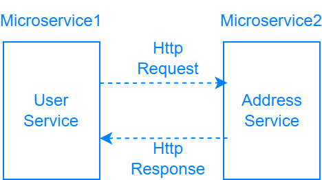

# Microservices-RestTemplate
A simple MicroService is built using Spring Boot, RestTemplate.


Synchronous Communication 
#### Address Service
Request:
```
GET http://localhost:8080/api/addresses/2
```
Response: 200 OK
```
{
    "id": 2,
    "fullAddress": "text",
    "city": "London",
    "country": "England",
    "postalCode": "AL01"
}
```
Request:
```
POST http://localhost:8080/api/addresses
```
Response: 201 Created
```
{
    "id": 3,
    "fullAddress": "text",
    "city": "Ankara",
    "country": "Turkey",
    "postalCode": "06"
}
```
#### User Service
Request:
````
GET http://localhost:8081/api/users/1
````
Response: 200 OK
```
{
    "address": {
        "id": 1,
        "fullAddress": "text",
        "city": "Istanbul",
        "postalCode": 34,
        "country": "Turkey"
    },
    "user": {
        "id": 1,
        "firstName": "esra",
        "lastName": "jojo",
        "email": "esra@gmail.com"
    }
}
```
